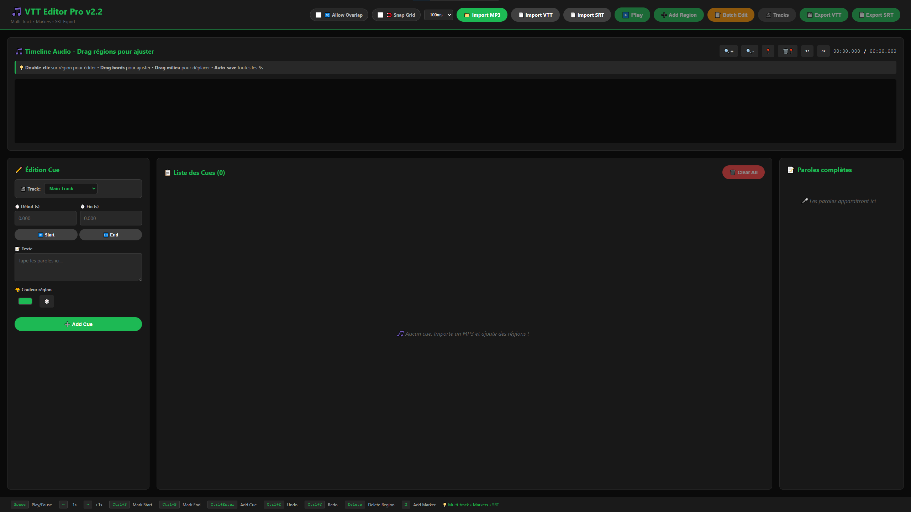
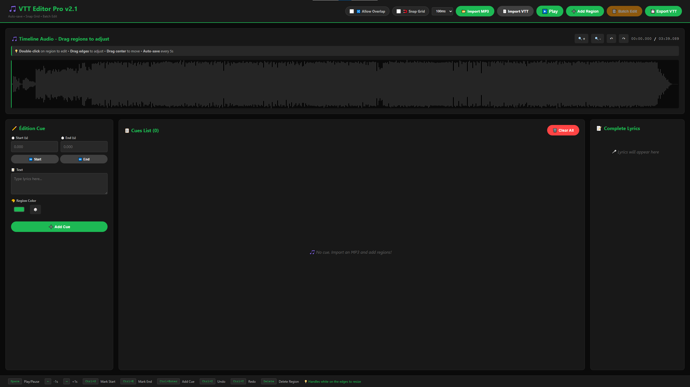

# 🎵 VTT Editor Pro v2.1

🚀 **[Try it online → https://rdtvlokip.github.io/vtt-editor-pro/vtt-editor-pro-v2.1.html](https://rdtvlokip.github.io/vtt-editor-pro/vtt-editor-pro-v2.1.html)**

A modern, lightweight, and powerful WebVTT subtitle editor that runs entirely in your browser. No installation, no signup, no cloud dependencies – just one HTML file.

**Clean starting point:**


**In action with live preview:**


---

## ✨ Features

### 🎨 **Modern Interface**
- Clean, dark-themed UI designed for extended editing sessions
- Color-coded regions for easy organization
- Real-time waveform visualization
- Responsive timeline with zoom controls
- **NEW:** Enhanced visual resize handles with real-time tooltips

### ⚡ **Powerful Editing**
- **Drag & Drop**: Move and resize regions directly on the timeline
- **Visual Resize Handles**: See exact timestamps while resizing regions
- **Snap-to-Grid**: Align regions precisely with configurable intervals (10ms to 1s)
- **Batch Text Editing**: Transform multiple cues at once with Find & Replace, case transformations, and prefix/suffix tools
- **Anti-overlap Enforcement**: Optional feature to prevent subtitle collisions
- **Live Preview**: Scrolling lyrics display synchronized with playback
- **Auto-save**: Your work is saved every 5 seconds (localStorage)

### 🎯 **Workflow Optimized**
- Import MP3/audio files directly
- Import/Export WebVTT format
- Keyboard shortcuts for rapid editing
- Precise timestamp control with snap-to-grid
- Visual waveform for accurate timing
- Undo/Redo with 20-step history

### 🚀 **Technical Highlights**
- **2570 lines** of vanilla JavaScript – no frameworks
- **~200 MB RAM** usage
- **Offline-first**: Works without internet connection
- **Single file**: Just download and open in your browser
- Zero external dependencies (except WaveSurfer.js CDN)

---

## 🆕 What's New in v2.1

### 1. 🎯 Visual Resize Handles with Tooltips
When you resize a region, a **real-time tooltip** displays the exact timestamp above your cursor. No more guessing – you see the precise timing as you drag.

**How it works:**
- Drag a region's edge to resize
- Tooltip appears with format: `00:01:23.456`
- Updates in real-time during resize
- Disappears automatically when you release

### 2. 🧲 Snap-to-Grid Alignment
Align your regions perfectly to a time grid. Ideal for professional subtitles that need precise timing intervals.

**Features:**
- Toggle Snap Grid on/off
- Choose interval: 10ms, 50ms, **100ms (default)**, 250ms, 500ms, 1s
- Auto-aligns on resize/move
- Works seamlessly with existing regions

**Use cases:**
- Music videos: snap to beats (100ms)
- Dialogue: snap to frames (50ms)
- Accessibility: consistent timing standards

### 3. 📝 Batch Text Editing
Edit multiple cues at once with a powerful modal interface featuring **3 specialized tabs**:

#### 🔍 **Find & Replace**
- Search and replace text across all cues
- Case-sensitive option
- Regex support for advanced patterns
- Shows count of modified cues

#### ✨ **Transform**
Apply text transformations to all cues:
- **UPPERCASE**: Convert everything to capitals
- **lowercase**: Convert everything to lowercase
- **Capitalize Each Word**: Title Case
- **Sentence case**: First letter capital only

#### 🔧 **Modify**
Add prefixes or suffixes with flexible range support:
- Add text to beginning/end of cues
- Target specific ranges: `all`, `1-5`, `1,3,5`, `1-3,7-10`
- Perfect for adding symbols (♪, ★) or formatting

**Example workflows:**
- Replace artist name in 50 cues: `Find: "John" → Replace: "Johnny"`
- Add music notes to chorus: `Prefix: "♪ " → Range: 10-25`
- Fix capitalization: `Transform → Sentence case`

---

## 📦 Installation

### Option 1: Direct Download (Recommended)
1. Download `vtt-editor-pro-v2.1.html`
2. Double-click to open in your browser
3. Start editing!

### Option 2: Use Online Version
Visit: [https://rdtvlokip.github.io/vtt-editor-pro/vtt-editor-pro-v2.1.html](https://rdtvlokip.github.io/vtt-editor-pro/vtt-editor-pro-v2.1.html)

### Option 3: Local Server
```bash
# Clone the repository
git clone https://github.com/RDTvlokip/vtt-editor-pro.git
cd vtt-editor-pro

# Open with a local server (optional)
python -m http.server 8000
# Navigate to http://localhost:8000/vtt-editor-pro-v2.1.html
```

---

## 🎯 Quick Start

1. **Import Audio**: Click `📂 Import MP3` to load your audio file
2. **Add Regions**: Click `➕ Add Region` or drag on the timeline
3. **Enable Snap Grid** (optional): Toggle `🧲 Snap Grid` and select interval
4. **Edit Text**: Type your subtitles in the text field
5. **Adjust Timing**: Drag region edges (watch the tooltip!) or use Start/End fields
6. **Use Batch Edit** (optional): Click `📝 Batch Edit` for bulk operations
7. **Export**: Click `💾 Export VTT` to save your file
---

## ⌨️ Keyboard Shortcuts

| Shortcut | Action |
|----------|--------|
| `Space` | Play/Pause audio |
| `←` | Jump back 1 second |
| `→` | Jump forward 1 second |
| `Ctrl+S` | Mark Start time |
| `Ctrl+E` | Mark End time |
| `Ctrl+Enter` | Add/Update Cue |
| `Ctrl+Z` | Undo (20-step history) |
| `Ctrl+Y` | Redo |
| `Delete` | Delete selected region |

---

## 🎨 Usage Tips

### Adjusting Regions
- **Move region**: Click & drag the middle
- **Resize region**: Click & drag the white handles on edges
- **Watch the tooltip**: Shows exact timestamp during resize
- **Double-click**: Edit region in the sidebar
- **Snap to grid**: Enable Snap Grid for auto-alignment

### Color Organization
- Use different colors to organize subtitle types (dialogue, music, SFX)
- Click the color picker in the sidebar
- Click 🎲 for random color
- Colors help visualize structure at a glance

### Snap-to-Grid Workflow
1. Enable `🧲 Snap Grid` toggle
2. Select interval (e.g., 100ms for music)
3. Resize/move regions – they snap automatically
4. Disable when you need pixel-perfect control

### Batch Editing Workflow
1. Create all your cues with timing
2. Click `📝 Batch Edit`
3. Use **Find & Replace** to fix typos globally
4. Use **Transform** to apply consistent casing
5. Use **Modify** to add symbols or formatting

### Anti-overlap Mode
- Toggle `🔀 Allow Overlap` to enable/disable
- When **disabled**: regions auto-adjust to prevent collisions
- When **enabled**: regions can overlap freely
- Useful for professional subtitle standards (no overlaps)

---

## 📚 Advanced Features

### Auto-save System
- Saves every **5 seconds** to `localStorage`
- Restores on page reload with confirmation prompt
- Works offline – no cloud required
- Clear with browser cache if needed

### Undo/Redo System
- **20-step history**
- Works with all operations (add, edit, delete, batch)
- Keyboard shortcuts: `Ctrl+Z` (undo), `Ctrl+Y` (redo)
- Visual button feedback (disabled when at history limit)

### Import/Export
- **Import VTT**: Parses existing WebVTT files
- **Import MP3**: Supports all browser-compatible audio formats
- **Export VTT**: Generates clean WebVTT format
- Filename auto-matches audio file

---

## 🗺️ Roadmap

### ✅ v2.1 (Released)
- [x] Visual resize handles with tooltips
- [x] Snap-to-grid alignment
- [x] Batch text editing

### v2.2 (In Progress)
- [X] Multi-Track Subtitle Support
- [X] Waveform Markers/Bookmarks
- [X] SRT Export/Import
- [X] Current Time Update
- [X] VTT Import Validation
- [X] Keyboard Shortcut Conflict
- [X] Waveform Color Update
- [X] Color Persistence in VTT

### v3.0 (Planned)
- [ ] Whisper API integration for auto-transcription
- [ ] FFMPEG.js for video support
- [ ] Export to ASS, SBV, DFXP formats
- [ ] Custom keyboard shortcuts
- [ ] Themes (light/dark/custom)

### Desktop Version (Under Consideration)
- [ ] Electron app with offline Whisper
- [ ] Local model support (tiny/base/small/medium)
- [ ] Native FFMPEG integration
- [ ] GPU acceleration for faster processing

---

## 🤝 Contributing

Contributions are welcome! This project is actively maintained.

### How to Contribute
1. Fork the repository
2. Create a feature branch (`git checkout -b feature/AmazingFeature`)
3. Commit your changes (`git commit -m 'Add AmazingFeature'`)
4. Push to the branch (`git push origin feature/AmazingFeature`)
5. Open a Pull Request

### Development Guidelines
- Keep it vanilla JS (no frameworks)
- Maintain single-file architecture
- Write clear comments for complex logic
- Test in Chrome, Firefox, and Safari
- Follow existing code style

### Reporting Issues
Found a bug or have a suggestion? [Open an issue](https://github.com/RDTvlokip/vtt-editor-pro/issues)

**Please include:**
- Browser version
- Steps to reproduce
- Expected vs actual behavior
- Screenshots if applicable

---

## 🔧 Technical Details

### Architecture
- **Single HTML file**: All CSS, JS, and HTML in one file
- **Vanilla JavaScript**: No build tools, no frameworks
- **WaveSurfer.js v7**: Waveform visualization and audio playback
- **localStorage**: Client-side persistence

### Browser Compatibility
| Browser | Version | Status |
|---------|---------|--------|
| Chrome | 90+ | ✅ Fully supported |
| Firefox | 88+ | ✅ Fully supported |
| Safari | 14+ | ✅ Fully supported |
| Edge | 90+ | ✅ Fully supported |

### Performance
- **Load time**: <2 seconds on modern browsers
- **Memory usage**: ~200 MB (depends on audio file size)
- **Max cues tested**: 1000+ without performance issues
- **Audio formats**: MP3, WAV, OGG, M4A, AAC

---

## 📄 License

This project is licensed under the **Creative Commons Attribution-NonCommercial 4.0 International License (CC BY-NC 4.0)** - see the [LICENSE.md](LICENSE.md) file for details.

### You are free to:
- ✅ **Share**: Copy and redistribute in any medium or format
- ✅ **Adapt**: Remix, transform, and build upon the material

### Under these terms:
- 📝 **Attribution**: Give appropriate credit to the original author
- 🚫 **NonCommercial**: Not for commercial use without permission

**Commercial use requires explicit permission.** Contact me for licensing inquiries.

---

## 🙏 Acknowledgments

- [WaveSurfer.js](https://wavesurfer-js.org/) - Audio waveform visualization library
- Inspired by Aegisub, but built for the modern web
- Community feedback from subtitle editors and content creators

---

## 👤 Author

**RDTvlokip (Théo)**
- 🧬 Creator of [AG-BPE](https://zenodo.org/records/16739553) (Attention-Guided Byte Pair Encoding)
- 🤖 Developer of InfiniGPT model family
- 🎓 TSSR Student specializing in Network Administration
- 🔗 GitHub: [@RDTvlokip](https://github.com/RDTvlokip)

---

## ☕ Support

If VTT Editor Pro helps you, consider supporting the project:

[](https://ko-fi.com/rdtvlokip)

Your support helps maintain and improve this tool!

---

## 📊 Stats


---

**Built with ❤️ using vanilla JavaScript**

[🐛 Report Bug](https://github.com/RDTvlokip/vtt-editor-pro/issues) • [✨ Request Feature](https://github.com/RDTvlokip/vtt-editor-pro/issues) • [📖 Documentation](https://github.com/RDTvlokip/vtt-editor-pro/wiki)

---

## 🌟 Star History

If you find this project useful, please consider giving it a ⭐ on GitHub!

---

<div align="center">

### Made with passion for subtitle editors worldwide 🌍

*No ads • No tracking • No subscriptions • Just pure functionality*

</div>
